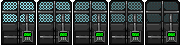

# 更新日志

### [1.3.1] - 2025-5-7

- 将T1 墙的`movementType`更改为`HOVER`，使墙可以在海上和陆地建造

### [1.3] - 2025-2-25

- 名称更改:T5 林大师墙 [强化] -> T5 林大师墙[加固]

- 删除了T5 林大师墙 [加固]的护盾光圈

- 绘制了T5 林大师墙 [超频]和T5 林大师墙 [加固]的贴图

  >   T5 林大师墙
  >
  >  ![T5 林大师墙 [超频]](./防御单位/6Reinroced-Vibraium-Wall/Untitled2.png) T5 林大师墙 [超频]
  >
  >  ![T5 林大师墙 [加固]](./防御单位/6Reinroced-Vibraium-Wall/Untitled3.png) T5 林大师墙 [加固]

- 修复了T5 林大师墙对空攻击失效的bug

- 参照升级模组6.3资源获取和单位属性，
  1. 上调了各级墙的制造花费
  2. 小幅上调了T1,T2,T3墙的生命值和护甲，使之在前期更有作用
  3. 下调T5 林大师墙生命值至`100000`
  4. 大幅下调了T5 林大师墙 [超频]的生命回复速率
  5. 大幅上调T5 林大师墙 [加固]生命值至`1000000`[^注2]
  
- 现在T5 林大师墙 [加固]和T5 林大师墙 [超频]在降级完成时会返还升级所需资源的一半

- 补充了林大师墙的说明文字

### [1.2] - 2025-2-24

- 由于专业建墙师可在陆军工厂T1制造，所以血量调整为`1300`，护盾调整为`100`，增加相当于侦察者T2的对地对空攻击能力，造价上调为`1500`

- 专业建墙师移动类型改为`HOVER`(悬浮)

- 在各等级墙的显示文本前加入等级前缀(如:T2)，补充了林大师墙的描述文本

- 参照升级模组6.3资源获取和单位属性，

  1. 上调了墙的造价
  2. 大幅提升了T5 林大师墙的近身对空攻击能力
  3. 下调T5 林大师墙血量至`200000`，移除护盾

- 新增T5 林大师墙的升级单位T5 林大师墙 [超频]和T5 林大师墙 [强化]\(可降级\)，具体数据可见下表
  | 名称 | 生命值 | 护盾值 | 生命回复速率 | 护盾回复速率 | 对空攻击 |  造价  |
  | :--: | :----: | :----: | :----------: | :----------: | :------: | :----: |
  | 原T5 | 200000 |   0    |      5       |      0       |   310    | 10000  |
  | 超频 | 200000 | 20000  |     150      |     100      |   3100   | 84000  |
  | 强化 | 500000 | 200000 |      10      |      10      |   1500   | 128000 |

- 对T5 林大师墙 [强化]增加了`radius:13`的护盾光圈

### [1.1] - 2025-2-23

- 修复了专业建墙师无法正常建墙的bug[^注1]
- 上调了墙的造价
- 其他平衡性调整

### [1.0] - 2025-2-23

本模组提供可升级的，美观的，实用的墙。为了和升级模组共存，不得不定义专业建墙师重写并替代游戏中内置的建造者。

参考代码和灵感来源:[AEA-CS-PACK](https://github.com/AEAOfficial/AEA-CS-Pack "Github"),[Mega Builder](https://rustedwarfare.org/wiki/Mega_Builder "RTW wiki")

[^注1]:原因在于更改了`[ai]`中的`useAsBuilder: true`
[^注2]:经过实战检验(3台T2 重机枪)，尽管调整后T5 林大师墙 [加固]生命值为T5 林大师墙 [超频]的5倍，但由于后者恐怖的回复能力，两者被摧毁时间相差不超过15秒

